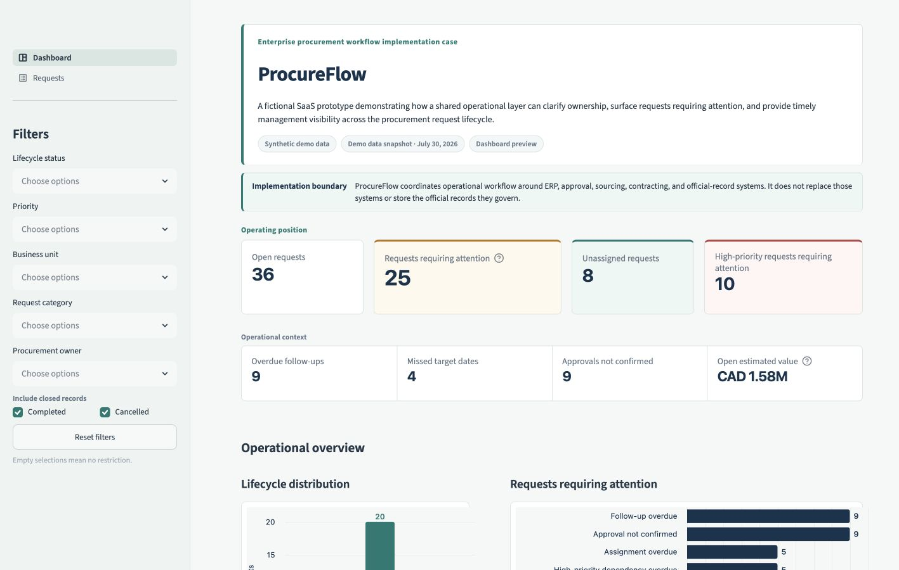
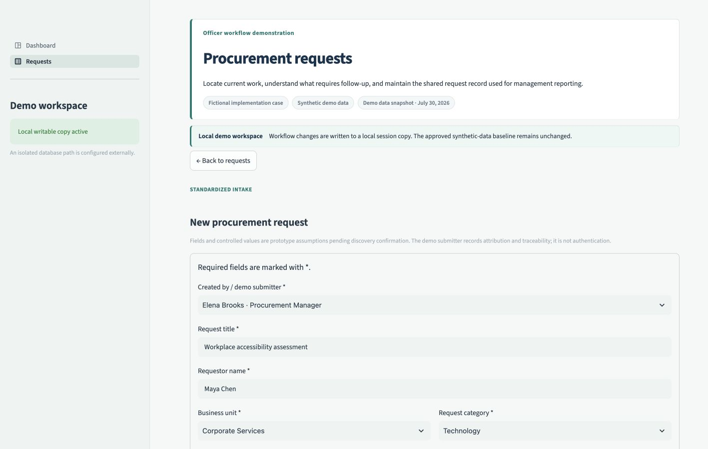
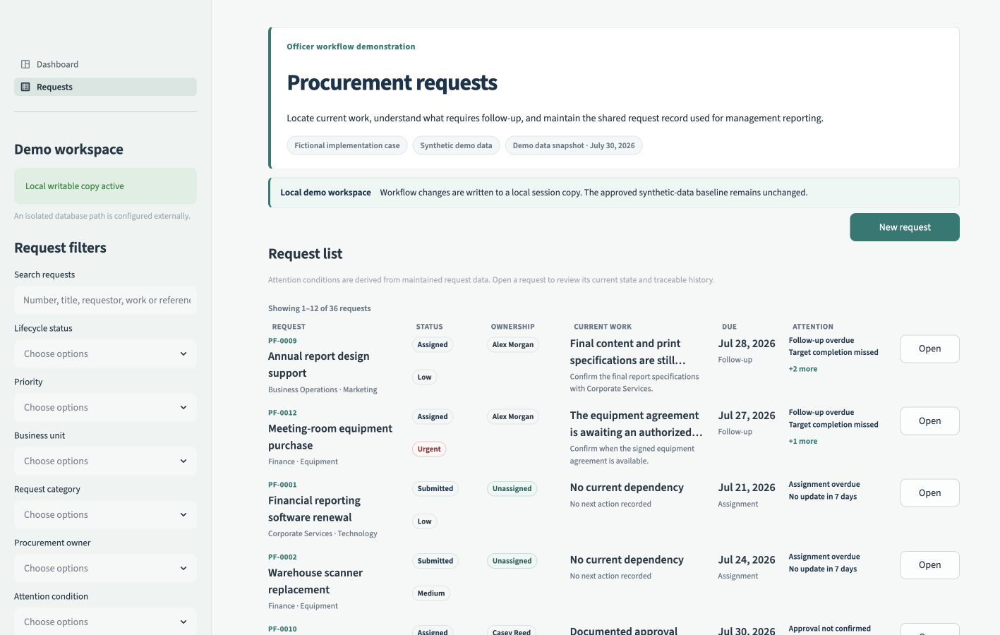
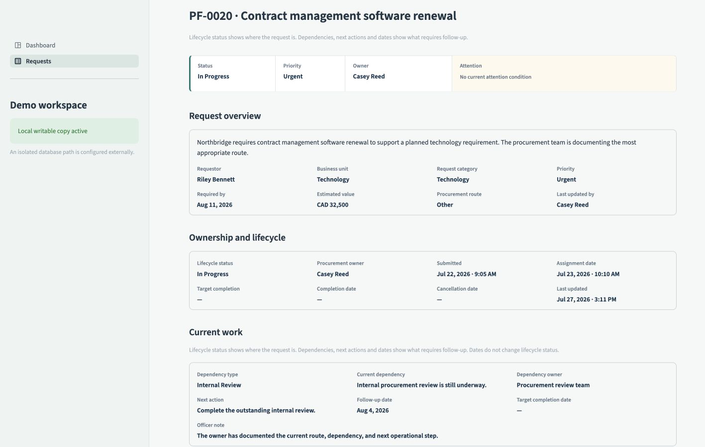

# ProcureFlow

ProcureFlow is a fictional procurement SaaS implementation case covering
discovery, process design, scope, data and integration considerations, security
and access requirements, UAT, training, and go-live readiness.

The case is based on a common operational challenge: procurement teams may use
different systems for approvals, financial transactions, contracts, and
official records, while still relying on email, spreadsheets, and individual
follow-up to manage the work between them.

ProcureFlow brings those operational steps into one shared workflow, from
request intake and assignment through follow-up, approval confirmation,
closure, and management reporting.

The project combines a working prototype with supporting implementation
materials covering discovery, current- and future-state processes,
requirements, data, integrations, UAT, training, and go-live planning.

**[Open the live demo](https://procureflow-procurement-workflow-umtcszaq2wmb3vwu8n2c8g.streamlit.app/)** ·
**[View the demo walkthrough](docs/demo_walkthrough.md)** ·
**[Review the solution architecture](docs/architecture.md)**



## Business problem

Procurement work often moves across several teams and systems.

A request may begin through email or a form. Approval may take place through a
finance process. Purchase orders and financial transactions may be managed in
an ERP. Contracts and official documents may be stored in a separate
repository.

Each system may serve a valid purpose, but the day-to-day work between them can
still be difficult to manage.

Teams may not have one consistent way to answer:

- Who currently owns the request?
- What is preventing it from moving forward?
- Who needs to respond next?
- When should the procurement officer follow up?
- Which target dates have been missed?
- How is work distributed across the team?
- Is management reporting based on current information?

The issue is not simply that information exists in different systems. The gap
is the lack of one operational view around the request.

## Implementation approach

The first step was to clarify where the operational gap existed and which
activities should remain in existing systems.

The proposed workflow follows a clear handoff:

1. A requestor or authorized user submits the request.
2. The request enters the workflow as **Submitted** and **Unassigned**.
3. An authorized procurement user assigns one procurement officer.
4. The assigned officer reviews the request and begins the work.
5. The officer maintains dependencies, next actions, dates, approval
   confirmation, related references, and closure information.
6. Managers use the same request data to review workload and identify work that
   requires attention.

Because this is a fictional case, the fields, roles, thresholds, and workflow
rules are working assumptions rather than requirements validated with a real
client.

In a client implementation, they would be confirmed through discovery
sessions, process walkthroughs, configuration discussions, and UAT.

## Solution design

ProcureFlow acts as a lightweight workflow layer around the existing
procurement process.

It brings together:

- standardized request intake;
- ownership and assignment;
- lifecycle status;
- current dependencies;
- next actions;
- follow-up and target dates;
- approval confirmation;
- related-system references;
- closure information;
- request history;
- management reporting.

The prototype has two main areas:

- **Requests**, where users submit and progress procurement work;
- **Dashboard**, where managers review workload, overdue actions, and requests
  requiring attention.

Both views use the same maintained request data, so there is no separate
reporting tracker to update.

## Key design decisions

### Request intake and procurement ownership are separate

A requestor or authorized user submits the request first.

The request is created as **Submitted** and **Unassigned**. An authorized
procurement user then reviews it and assigns one officer.

This keeps request intake separate from procurement ownership and makes the
handoff clear.

### Waiting is not a separate lifecycle stage

ProcureFlow uses five lifecycle statuses:

- Submitted
- Assigned
- In Progress
- Completed
- Cancelled

A request that is waiting for information remains **In Progress**.

The dependency, dependency owner, next action, and follow-up date explain what
is holding it up and what should happen next.

This keeps two different concepts separate:

- lifecycle status shows where the request is in the process;
- attention conditions show whether action is currently needed.

### Formal approval remains outside ProcureFlow

ProcureFlow records whether approval is required and whether confirmation has
been received.

It can also record:

- the approval source;
- the approval reference;
- the confirmation date;
- a supporting note.

It does not grant the approval.

The formal decision remains in the process or system responsible for it.

### Official records remain in their source systems

Purchase orders, contracts, amendments, approval records, and official
documents are not recreated in ProcureFlow.

The request stores the relevant identifier, source, and link. This gives users
the context they need without introducing another unofficial repository.

### Attention is calculated from the operational record

Users do not manually maintain a separate attention tracker.

ProcureFlow identifies conditions such as:

- assignment overdue;
- follow-up overdue;
- target date missed;
- required information outstanding;
- approval not confirmed;
- no recent update;
- closure evidence missing.

These conditions are calculated from the same information used to manage the
request.

### The original demo data remains protected

The application starts with a fixed synthetic dataset.

When a reviewer creates or updates a request, the application uses a temporary
writable copy. This makes the workflow interactive while preserving the
starting dataset.

## User workflow

### Requestor or authorized user

Submits the required information through standardized intake.

The request is created as **Submitted** and **Unassigned**.

### Authorized procurement user

Reviews the submitted request and assigns one procurement officer.

The assignment actor and date are recorded.

### Assigned procurement officer

Progresses the request by maintaining:

- current dependencies;
- dependency ownership;
- next actions;
- follow-up dates;
- target dates;
- procurement route;
- approval confirmation;
- related references;
- closure information;
- request history.

The roles in this prototype are simulated for workflow demonstration and
attribution. They are not production authentication or access control.

## Management visibility

The Dashboard helps managers move from general reporting to specific work that
may need attention.

It shows:

- open requests;
- unassigned requests;
- overdue follow-ups;
- missed target dates;
- high-priority requests;
- workload by owner;
- lifecycle and category distribution;
- requests requiring attention;
- the reason attention is required;
- the next action recorded on the request.

The Dashboard and Requests views use the same maintained request data. There is
no separate reporting update in the prototype.

## Prototype walkthrough

### Standardized intake

A requestor or authorized user submits the minimum information needed to begin
the workflow.

The request is created as **Submitted** and **Unassigned**.



### Procurement workspace

Procurement users can review submitted requests, assign ownership, and identify
work that needs attention.



### Request detail and history

The Request Detail view supports assignment, active work, dependencies,
approval confirmation, related references, closure, and chronological history.



The [demo walkthrough](docs/demo_walkthrough.md) follows one fictional request
from submission through completion.

## What would be confirmed with a client

The prototype provides a starting point for discussion, not a final client
configuration.

Before implementation, the following areas would need to be confirmed.

### Process and roles

- Who can submit a request?
- Can users submit on behalf of someone else?
- Who reviews and assigns new requests?
- When does responsibility transfer to the procurement officer?
- Do the proposed lifecycle statuses reflect the actual process?
- What is required before a request can be completed or cancelled?

### Data

- Which intake fields are mandatory?
- Which values should use controlled lists?
- Which system owns each data element?
- Which identifiers need to be exchanged between systems?
- What should happen when source information is incomplete?
- Which changes need to remain visible in history?

### Reporting

- Which measures support actual management decisions?
- How should overdue work be defined?
- Which conditions require escalation?
- How should workload be grouped and filtered?
- How current does reporting need to be?

### Integrations

- Which systems need to exchange data with the solution?
- What data needs to move in each direction?
- Which APIs or other integration methods are available?
- How will records be matched?
- How should failed or incomplete integrations be handled?
- Who will monitor and support the integrations?

### Security and access

- Which roles should be able to view, submit, assign, update, or close a
  request?
- Which information is sensitive?
- What audit and retention requirements apply?
- How should access be granted, reviewed, and removed?
- Which controls are required before production use?

### Adoption and readiness

- Which user groups need training?
- Which scenarios should be included in UAT?
- What data and configuration must be ready before go-live?
- Who approves readiness?
- What support is required after launch?
- How will implementation success be measured?

Those decisions would guide the final configuration, integrations, testing,
training, and rollout plan.

## Architecture

```text
Streamlit user interface
  ├── Requests
  │     ├── Standardized intake
  │     ├── Procurement workspace
  │     ├── Request detail
  │     └── Workflow actions and history
  │
  └── Dashboard
        ├── Operational indicators
        ├── Workload reporting
        ├── Lifecycle and category reporting
        └── Attention reporting
                 ↓
Shared query and business-rule layer
                 ↓
Shared database services and validation
                 ↓
DuckDB relational data model
  ├── Users
  ├── Requests
  ├── Related references
  └── Request history